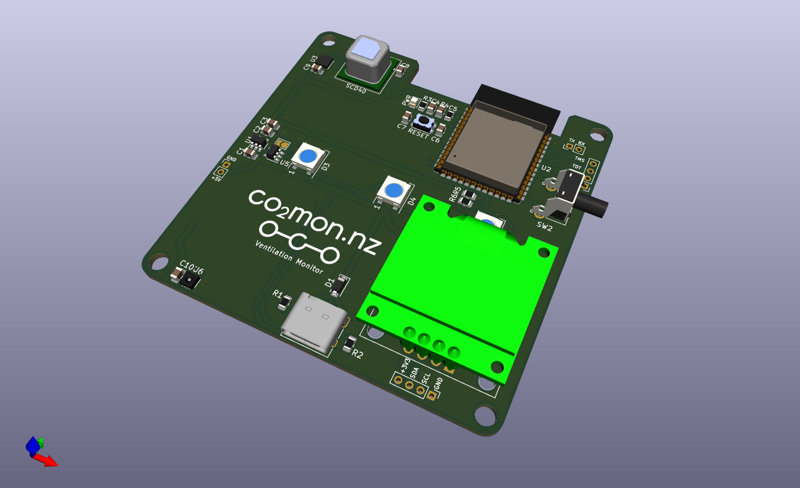

# co2mon.nz Ventilation Monitor

Inspired by https://github.com/oseiler2/CO2Monitor

## Description

This is a prototype CO2 based ventilation monitor intended for fixed
(wall-mounted) use in standard residential, office and retail type spaces. It
uses the well regards Sensirion SCD40 CO2 sensor as well as a Bosch BME680 for
VOC and barometric pressure measurement and a Sensirion SHT30 for temperature
and humidity.

WiFi connectivity is provided by the main ESP32-S3 processor allowing
measurements to be reported back to the https://co2mon.nz/ web service if
desired.

An accompanying 3D printable case design can be found in the
https://github.com/co2monnz/cad repository.

## License, Copyright and Reuse

© 2023 [MKMBA Ltd](https://www.mkmba.nz/).

The design files (e.g. schematics, pcb layout and associated data) in this
repository are available under the terms of the CC-BY-NC license detailed in
the accompanying LICENSE file. 

There doesn't seem to be any perfect way of licensing hadware designs that I've
found yet, so if the CC-BY-NC terms are not suitable for you please get in
touch and I'll generally be fairly wiling to consider other options including
for commercial re-use, etc.
